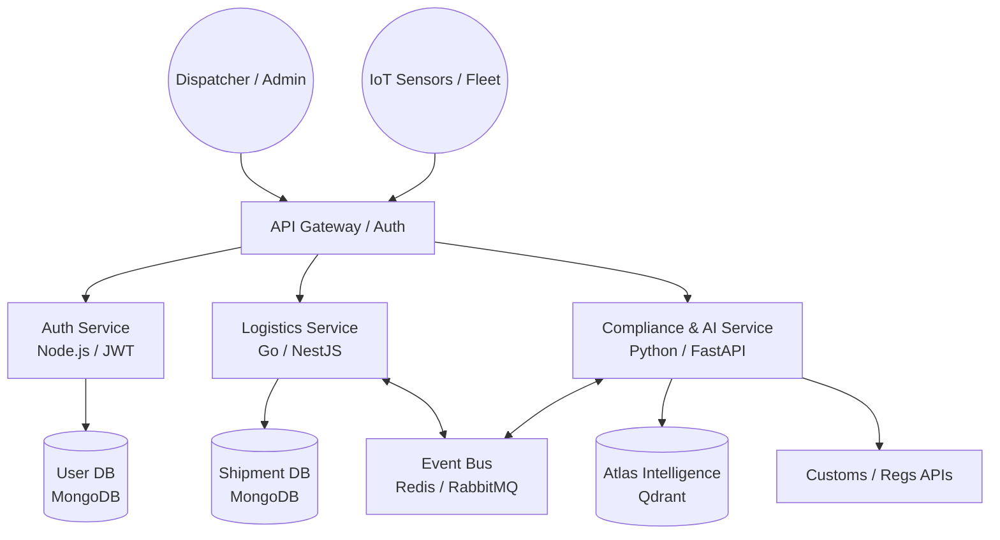

# EcoRoute Atlas — Production System Architecture

**EcoRoute Atlas** is a high-performance, AI-driven backend system for global supply chain management, sustainability tracking, and regulatory compliance.

---

## 1. High-Level Architecture Overview

The system is built using a **Microservices Architecture** to ensure scalability and fault tolerance.



---

## 2. Database Schema (Production-Grade)

### 2.1 MongoDB: Structured Data
Stored in the `ecoroute_core` database.

#### **Collection: `shipments`**
```json
{
  "_id": "uuid",
  "tracking_number": "ATLAS-123456",
  "status": "in_transit",
  "origin": { "city": "Berlin", "code": "BER", "coords": [13.4, 52.5] },
  "destination": { "city": "Singapore", "code": "SIN", "coords": [103.8, 1.3] },
  "current_location": { "lat": 12.3, "lng": 45.6, "timestamp": "2024-03-20T10:00Z" },
  "carrier": "GlobalFleet Express",
  "cargo_type": "Hazardous (Class 3)",
  "environmental_impact": { "code_estimate_kg": 450, "route_efficiency": 0.85 },
  "metadata": { "created_at": "...", "updated_at": "..." }
}
```

#### **Collection: `fleet_units`**
```json
{
  "_id": "uuid",
  "unit_id": "TRUCK-99",
  "type": "EV_SEMI",
  "battery_health": 0.94,
  "last_maintenance": "2024-01-15",
  "current_driver_id": "uuid"
}
```

---

### 2.2 Qdrant: The "Atlas Intelligence"
Vectorized unstructured knowledge for real-time compliance and FAQ retrieval.

| Field | Type | Description |
| :--- | :--- | :--- |
| `text` | String | Raw text of a regulation, policy, or past resolution. |
| `category` | String | e.g., `customs`, `safety`, `emissions`, `route_optimization`. |
| `region` | String | e.g., `EU`, `ASEAN`, `US-CAN`. |
| `version` | String | Semantic version of the regulation. |
| `confidence` | Float | (0.0-1.0) Logic for trust level. |

---

## 3. The "Atlas" AI Integration

The `Atlas` AI is the **Intelligence Layer** of the system.

### **Key Pipelines:**
1.  **Direct Inference (The "Hybrid" Path):**
    *   *User Query:* "What are the current hazmat shipping restrictions for Singapore?"
    *   *Atlas Action:* Queries **MongoDB** for specific product specs + **Qdrant** for Singapore's latest legislation → Synthesizes an answer.
2.  **Learning Pipeline:**
    *   *Input:* New trade agreement PDFs uploaded by admins.
    *   *Atlas Action:* Extracts patterns, chunks the text, and updates the **Atlas Intelligence**.
3.  **Refinement Cron:**
    *   Deduplicates similar shipping policies to ensure the bot doesn't give conflicting advice.

---

## 4. API & Infrastructure Strategy

### **Core API Endpoints:**
*   `POST /v1/shipments`: Create new tracking entry.
*   `GET /v1/atlas/query`: Main AI interface for natural language questions.
*   *Admin Ingestion:* `POST /v1/admin/ingest`: Upload new regulation docs for the Learning Pipeline.

---
