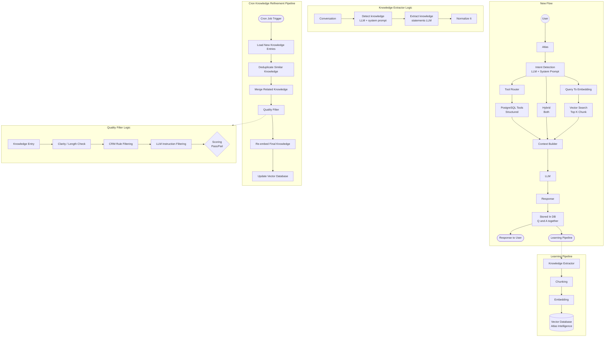

# AI System Architecture

## 1. New Flow (Inference Pipeline)
The primary path for handling user queries and generating responses.

* **User** → **Atlas**
* **Intent Detection:** (LLM + System Prompt) branches into three potential paths:
    1.  **DB Query Path:** Tool Router (Decide tool type) → PostgreSQL Tools (Structured).
    2.  **Hybrid:** Combines both Structured and Unstructured data.
    3.  **Knowledge Brain Path:** Query To Embedding → Vector Search (Top K Chunk).
* **Context Builder:** Aggregates data from the paths above.
* **LLM** → **Response**
* **Stored In DB:** (Q and A together)
    * → **Response to User**
    * → **Learning Pipeline** (Feedback loop)

---

## 2. Learning Pipeline
Processes raw data into the system's **Atlas Intelligence**.

* **Knowledge Extractor** → **Chunking** → **Embedding** → **Vector Database (Atlas Intelligence)**

---

## 3. Knowledge Extractor
The logic used to pull insights from conversations.

* **Conversation** → **Detect knowledge** (LLM + system prompt) → **Extract knowledge statements** (LLM) → **Normalize It**

---

## 4. Cron Knowledge Refinement Pipeline
A scheduled process to maintain and improve the quality of the Vector DB.

1.  **Cron Job Trigger:** Load New Knowledge Entries (from vector DB added since last update).
2.  **Deduplicate Similar Knowledge:** (remove near-duplicate entries).
3.  **Merge Related Knowledge:** (combine fragments into better statements).
4.  **Quality Filter:** (remove low-quality or useless entries).
5.  **Re-embed Final Knowledge:** (generate fresh embeddings).
6.  **Update Vector Database:** (replace old entries).

---

## 5. Quality Filter
The specific logic used to score and vet new knowledge entries.

* **Knowledge Entry** → **Clarity / Length Check** → **CRM Rule Filtering** → **LLM Instruction Filtering** → **Scoring Pass/Fail**

---

## 6. Mermaid Diagram

---
