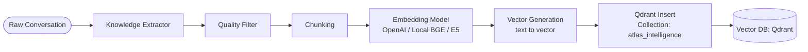
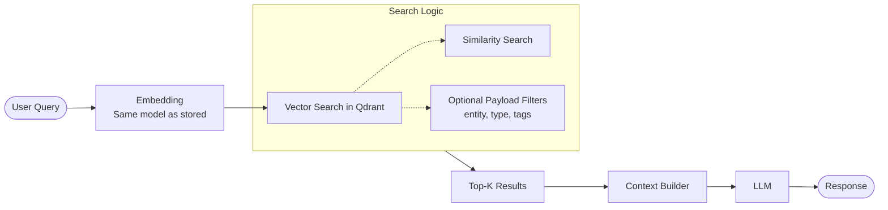

# Atlas Intelligence — Vector Flow Documentation

## 1. Core Principles (Key Points)
* **Model Consistency:** Embedding model consistency is critical; embeddings break if the model changes.
* **Migration:** Always re-embed all existing entries when changing the embedding provider.
* **Versioning:** Always store the embedding model version in metadata for safety.
* **Separation of Concerns:** Vector DB (Qdrant) is fully separate from the structured data (PostgreSQL).
* **Definitions:**
    * **Embedding** = Vector generation.
    * **Vector** = Numeric representation of text.
    * **Vector Search** = Retrieving most similar vectors.

---

## 2. Store in Atlas Intelligence Flow
This pipeline converts raw conversations into searchable vector entries.

### Qdrant Payload Schema
When inserting into the `atlas_intelligence` collection, each entry includes:
* **Vector:** The numerical embedding.
* **Payload (Metadata):**
    * `text`: The raw extracted knowledge.
    * `type`: (policy / faq / insight)
    * `entity`: (e.g., Barclays / Gold Bank)
    * `source`: (chat / manual / system)
    * `confidence`: (0.0 - 1.0)
    * `tags`: Array of strings.
    * `created_at`: Timestamp.
    * `embedding_model`: Version string.

---

## 3. Query Flow
The retrieval process for answering user questions in real-time.

---

## Summary Table: DB Comparison

| Feature | PostgreSQL (Structured) | Qdrant (Vector DB) |
| :--- | :--- | :--- |
| **Purpose** | CRM/Logistics data | Semantic search, Atlas Intelligence |
| **Data Type** | Structured (JSONB support) | Embeddings + Metadata |
| **Search Method** | SQL / Indexing | Cosine Similarity / Euclidean |
| **Maintenance** | Schema updates | Cron Refinement / Re-embedding |

---